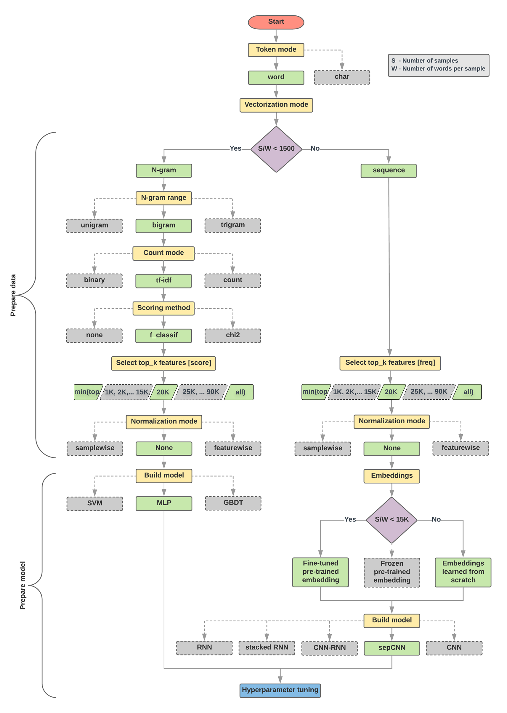

# 选择一个模型
此时，我们已经汇总了我们的数据集，并深入了解了我们数据的关键特征。 接下来，根据我们在第2步中收集的指标，我们应该考虑应该使用哪种分类模型。 这意味着/提出问题，例如“我们如何将文本数据呈现给期望数字输入的算法？”（这称为数据预处理和矢量化），“我们应该使用什么类型的模型？”，“什么配置参数 我们应该使用我们的模型吗？“等

经过数十年的研究，我们可以访问大量的数据预处理和模型配置选项。然而，可供选择的大量可行选项的可用性极大地增加了手头的特定问题的复杂性和范围。鉴于最好的选择可能并不明显，一个天真的解决方案是尽力尝试每一种可能的选择，通过直觉修剪一些选择。然而，这将是非常耗时的。

在本指南中，我们尝试显着简化选择文本分类模型的过程。对于给定的数据集，我们的目标是找到实现接近最大精度的算法，同时最小化训练所需的计算时间。我们针对不同类型的问题（特别是情绪分析和主题分类问题）运行了大量（~450K）实验，使用12个数据集，交替用于不同数据预处理技术和不同模型体系结构之间的每个数据集。这有助于我们识别影响最佳选择的数据集参数。

下面的模型选择算法和流程图是我们实验的总结。如果您还不理解其中使用的所有术语，请不要担心;本指南的以下部分将对它们进行深入解释。

### 数据准备与模型构建算法
1.计算每个样本比例的样本数/单词数。
2.如果此比率小于1500，则将文本标记为n-gram，并使用简单的多层感知器（MLP）模型对它们进行分类（下面的流程图中的左分支）：
  a. 将样本分成单词n-gram;将n-gram转换为向量。
  b. 评分向量的重要性，然后使用分数选择前20K。
  c. 建立MLP模型。
3.如果比率大于1500，则将文本标记为序列并使用sepCNN模型对它们进行分类（下面的流程图中的右分支）：
  a. 将样本分成单词;根据频率选择前20K字。
  b. 将样本转换为单词序列向量。
  c. 如果原始样本数/每个样本比率的单词数小于15K，则使用sepCNN模型进行微调预训练嵌入可能会提供最佳结果。
4.使用不同的超参数值测量模型性能，以找到数据集的最佳模型配置。

在下面的流程图中，黄色框表示数据和模型准备过程。 灰色框和绿色框表示我们为每个过程考虑的选择。 绿色框表示我们对每个过程的建议选择。

您可以使用此流程图作为构建第一个实验的起点，因为它可以以较低的计算成本为您提供良好的准确性。 然后，您可以在后续迭代中继续改进初始模型。



### 图5：文本分类流程图

此流程图回答了两个关键问题：

1.我们应该使用哪种学习算法或模型？

2.我们应该如何准备数据以有效地学习文本和标签之间的关系？

第二个问题的答案取决于第一个问题的答案; 我们预先处理数据的方式将取决于我们选择的模型。 模型可以大致分为两类：使用单词排序信息的那些（序列模型），以及仅将文本视为“包”（组）单词（n-gram模型）的模型。 序列模型的类型包括卷积神经网络（CNN），递归神经网络（RNN）及其变体。 n-gram模型的类型包括逻辑回归，简单的多层感知器（MLP或完全连接的神经网络），梯度增强树和支持向量机。

从我们的实验中，我们观察到“样本数”（S）与“每个样本的单词数”（W）的比率与哪个模型表现良好相关。

当该比率的值很小（<1500）时，以n-gram作为输入的小型多层感知器（我们称之为选项A）表现得更好或至少与序列模型一样好。 MLP易于定义和理解，并且它们比序列模型花费更少的计算时间。 当此比率的值很大（> = 1500）时，使用序列模型（选项B）。 在接下来的步骤中，您可以根据样本/每个样本的单词比率跳过所选模型类型的相关小节（标记为A或B）。

在我们的IMDb审查数据集的情况下，样本/每个样本的单词比率为~144。 这意味着我们将创建一个MLP模型。
```
注意：使用上面的流程图时，请注意，由于以下几个原因，它可能不一定会使您获得问题的最佳结果：
- 你的目标可能不同。 我们针对可在尽可能短的计算时间内实现的最佳精度进行了优化。 替代流程可以产生更好的结果，例如，在优化曲线下面积（AUC）时。
- 我们选择了典型和常见的算法选择。 随着该领域的不断发展，新的尖端算法和增强功能可能与您的数据相关，并且可能表现更好。
- 虽然我们使用多个数据集来派生和验证流程图，但您的数据集可能有一些特定的特性，这些特征有利于使用备用流程。
```

